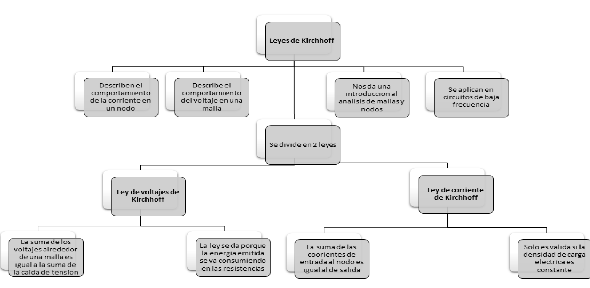

# PRACTICA-No.-1-LEYES-DE-KIRCHHOFF
# Informe 

1. OBJETIVOS 

1.1. OBJETIVO GENERAL

- Adaptar un  diagrama electrico a un prototipo virtual mediante el uso de Tinkercad para comprender de mejor manera como se aplican las leyes de Kirchhoff en un circuito electrico.

 1.2. OBJETIVO ESPECIFICO

- Calcular la intensidad de corriente y el voltaje que atraviesa por el circuito mediante las leyes de Kirchhoff.
- Diferenciar los resultados obtenidos analiticamente y mediante el simulador Tinkercad para poder detenerminar cual es el porsentaje de error.
- Aclarar la utilizacin del multimetro al momento de medir la corriente y el voltaje en un circuito.

2. MARCO TEORICO

3. DIAGRAMAS

4. LISTA DE COMPONENTES

| CANTIDAD|MATERIAL O EQUIPO|
| ----- | ---- |
| 1|Fuente de Voltaje de C.D.|
|2|Multimetros digitales|
|1|Resistor de 1 kΩ|
|2|Resistores de 2.2 kΩ|
|1|Resistor de 1.8 kΩ|
|1|Resistor de 3.9 kΩ|
|1|Protoboard|

Tambien se utilizo tinkercad que nos sirvio como laboratorio virtual.

5. EXPLICACION 

Una vez que pasamos del diagrama a l protoboard en tinkercad procedemos a la medicion de la intensidad y el voltaje de cada resistencia .

Para medir la intensidad es necesario hacerlo  en serio, caso contrario no calculariamos nada

6. MANUAL DE USUARIO

7. DESCRIPCION DE PRERREQUISITOS Y CONFIGURACIONES

8. CONCLUCION 

- Gracias a la aplicacon de tinkercad se pudo pasar de un modelo esquematico a uno un poco mas real donde se logro observar cual es la manera correcta de conectar un circuito mixto y a su vez nos permitio comprobar el funcionamiento de las leyes de Kirchhoff de una manera mas real.
- El multimetro fue una herramienta de gran utilidad al momento de medir la intensidad y el voltaje que pasa por el circuito , tomando en cuenta que para medir las resistencias se debe realizar en serie.
- Al ser tinkercad una plataforma on-line es poco probable tener un margen de error si tomamos en cuenta los valores medidos y los calculados, podria haber un porsentaje de error pero seria minimo, esta variacion en los calculos se los puede evidenciar de mejor manera cuando se arme el circuito de forma fisica.
9. BIBLIOGRAFIA

